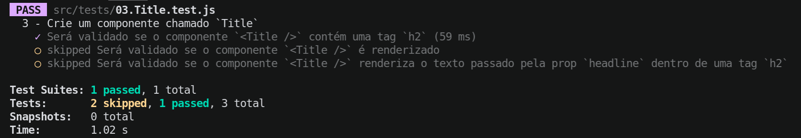

# Boas-vindas ao repositório do exercício Best Reads!

Para realizar o exercício, atente-se a cada passo descrito a seguir e, se tiver qualquer dúvida, envie-a por _Slack_! 🚀

Aqui você vai encontrar os detalhes de como estruturar o desenvolvimento do seu exercício, utilizando uma _branch_ específica e um _pull request_ (PR) para colocar seus códigos.

# Termos e acordos

Ao iniciar este exercício, você concorda com as diretrizes do Código de Conduta e do Manual da Pessoa Estudante da Trybe.

# Entregáveis

<details>
  <summary><strong>🤷🏽‍♀️ Como entregar</strong></summary><br />

Para entregar o seu exercício você deverá criar um _pull request_ neste repositório.

> **Relembrando 🧠**: Lembre-se que você pode consultar nosso conteúdo sobre [Git & GitHub](https://app.betrybe.com/course/4d67f5b4-34a6-489f-a205-b6c7dc50fc16/) e nosso [Blog - Git & GitHub](https://blog.betrybe.com/tecnologia/git-e-github/) sempre que precisar!

</details>

<details>
  <summary><strong>👨‍💻 O que deverá ser desenvolvido</strong></summary><br />

  Neste exercício, você vai desenvolver uma aplicação que renderizará um livro que poderá ser adicionado a diferentes listas de leitura. Para isso, utilize o React para gerenciar o estado das listas e também capturar eventos.

</details>

<details>
  <summary><strong>:memo: Habilidades</strong></summary><br />

Neste exercício, verificamos se você é capaz de:

- Inicializar um componente, dando a ele um estado predefinido;

- Ler o estado de um componente e usá-lo para alterar o que exibimos no _browser_;

- Atualizar o estado de um componente;

- Capturar eventos utilizando a sintaxe do React.

</details>


# Orientações


<details>
  <summary><strong>🎛 Linter</strong></summary><br />

Para garantir a qualidade do código, vamos utilizar neste exercício os linters `ESLint` e `StyleLint`.
Assim o código estará alinhado com as boas práticas de desenvolvimento, sendo mais legível
e de fácil manutenção! Para rodá-los localmente, execute os comandos abaixo:

```bash
  npm run lint
  npm run lint:styles
```

⚠️ **Pull requests com issues de Linter não serão avaliadas. Atente-se para resolvê-las antes de finalizar o desenvolvimento!** ⚠️


</details>


<details>
  <summary><strong>🛠 Testes</strong></summary><br />

Para avaliar o exercício utilizaremos [React Testing Library (RTL)](https://testing-library.com/docs/react-testing-library/intro) para execução dos testes.

Na descrição dos requisitos (logo abaixo) será pedido que seja feita a adição de atributos data-testid nos elementos **HTML**. Vamos a um exemplo para deixar evidente essa configuração: se o requisito pedir "crie um botão e adicione o id de teste (ou data-testid) com o valor my-action, você pode escrever:

```html
<button data-testid="my-action"></button>
```

ou

```html
<a data-testid="my-action"></a>
```

Ou seja, o atributo `data-testid="my-action"` servirá para o React Testing Library(RTL) identificar o elemento e, dessa forma, conseguiremos realizar testes focados no comportamento da aplicação.

⚠ **Atenção:** muito cuidado com os nomes especificados nos requisitos! O conteúdo deve ser exatamente igual ao texto descrito no requisito.

Para verificar a solução proposta, você pode executar todos os testes localmente, basta executar:

```bash
npm test
```

💡 **Dica: desativando testes**

Especialmente no início, quando a maioria dos testes está falhando, a saída após executar os testes é extensa. Você pode desabilitar temporariamente um teste utilizando a função `skip` junto à função `it`. Como o nome indica, esta função "pula" um teste. Veja um exemplo:

```js
it.skip("Será validado se o campo de filtro por nome renderiza na tela", () => {
  render(<App />);
  const filterNameInput = screen.getByTestId(/name-filter/i);
  expect(filterNameInput).toBeInTheDocument();
});
```


Uma estratégia é pular todos os testes no início e ir implementando um teste de cada vez, removendo dele a função `skip`.

Você também pode rodar apenas um arquivo de teste, por exemplo:

```bash
npm test 
```

Uma outra forma para contornar esse problema é a utilização da função `.only` após o `it`. Com isso, será possível que apenas um requisito rode localmente e seja avaliado.

```js
it.only("Será validado se o campo de filtro por nome renderiza na tela", () => {
  render(<App />);
  const filterNameInput = screen.getByTestId(/name-filter/i);
  expect(filterNameInput).toBeInTheDocument();
});
```



⚠️ **O avaliador automático não necessariamente avalia seu exercício na ordem em que os requisitos aparecem no readme. Isso acontece para deixar o processo de avaliação mais rápido. Então, não se assuste se isso acontecer, ok?**

</details>

<details>
  <summary><strong>🗂 Compartilhe seu portfólio!</strong></summary><br />

Você sabia que o LinkedIn é a principal rede social profissional e compartilhar o seu aprendizado lá é muito importante para quem deseja construir uma carreira de sucesso? Compartilhe esse exercício no seu LinkedIn, marque o perfil da Trybe (@trybe) e mostre para a sua rede toda a sua evolução.

</details>

# Requisitos

## 1. Faça com que o próximo livro da lista seja exibido ao clicar no botão `Próximo livro`.

<details>
  <summary>Exiba o próximo livro da lista</summary><br />

- Faça com que o próximo livro da lista seja exibido ao clicar no botão `Próximo livro` de forma que ele percorra toda a lista.

- Ao chegar no último livro da lista, o próximo livro deverá ser o primeiro da lista novamente.

</details>

<details>
  <summary><strong>O que será verificado</strong></summary><br />

- Se, ao carregar a página, as informações do primeiro livro da lista são exibidas.
- Se, ao clicar no botão `Próximo livro`, as informações dos próximos livros da lista são exibidas.
- Se, ao chegar no último livro da lista, ao clicar no botão `Próximo livro`, as informações do primeiro livro da lista são exibidas.

</details>

## 2. Gerencie o estado para cada uma das listas e exiba por padrão a lista de desejos

<details>
  <summary>Implemente a funcionalidade dos botões de adição</summary><br />

- Ao clicar em um dos botões que adicionam um livro a uma lista, as informações do livro devem ser adicionadas à respectiva lista.
- Exiba a lista de desejos por padrão no componente `BookList`.

</details>

<details>
  <summary><strong>O que será verificado</strong></summary><br />

- Se, ao clicar no botão `Adicionar à lista de desejos`, o livro é adicionado à lista de desejos, e as informações do livro são exibidas na tela.

</details>

## 3. Faça com que seja possível mudar a lista exibida ao clicar em um dos botões de exibição

<details>
<summary>Implemente a funcionalidade dos botões de exibição</summary><br />

  - Ao clicar em um dos botões de exibição, a lista exibida deve ser alterada para a lista correspondente ao botão clicado.

</details>

<details>
  <summary><strong>O que será verificado</strong></summary><br />

- Se, ao clicar no botão `Exibir lista de desejos`, a lista de desejos é exibida.
- Se, ao clicar no botão `Exibir lista de leitura`, a lista de leitura é exibida.
- Se, ao clicar no botão `Exibir lista de lidos`, a lista de lidos é exibida.

</details>

# Exercícios extras 

- **Observação 🔎**: Esses exercícios não são testados pelo avaliador.

<details>
<summary>Implemente a funcionalidade para excluir um livro de uma das listas</summary><br />

  - Crie um botão `Excluir` no componente `Book` que deve ser apenas renderizado dentro da lista e não na exibição de detalhes do livro.
  - Ao clicar no botão `Excluir` de um livro, o livro deve ser removido da lista correspondente.

</details>

<details>
<summary>Exiba o nome da lista selecionada</summary><br />

  - Exiba o nome da lista selecionada no lugar do Texto `"Lista de ..."`.
</details>

<details>
  <summary>Embeleze a aplicação<code>css</code></summary><br />
  
- Faça com que a aplicação fique bonita, utilizando `css` para isso.

</details>
